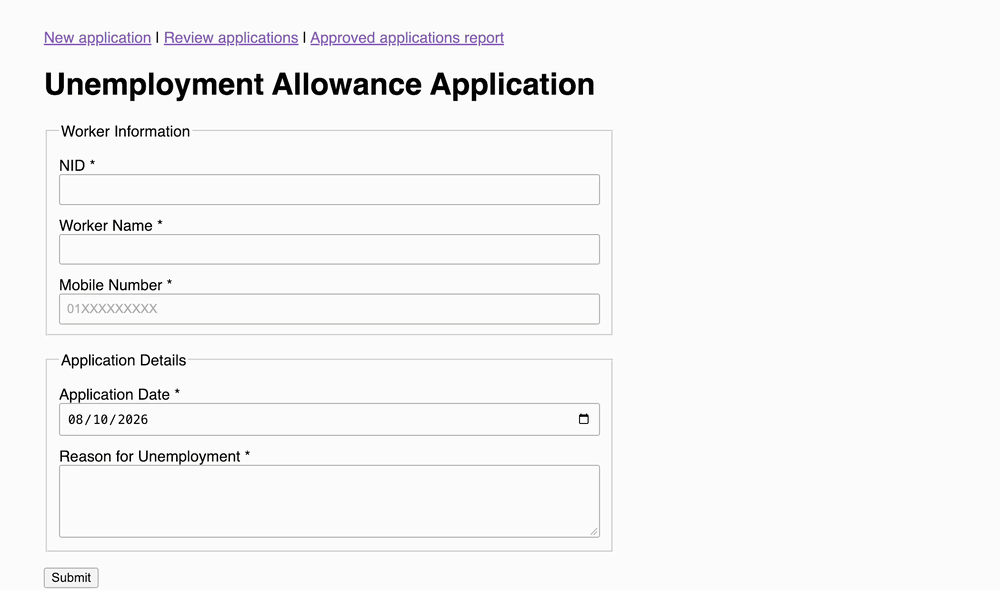

# Unemployment Allowance Programme Ecorys Practical
## Demo

[Watch the high-quality video here](docs/demo.mp4)

## Running the project:

Unemployment Allowance Programme Ecorys Practical Exam

These are needed to run this project:
1. JDK 17
2. MySQL 8.0 running on localhost 3306 port

this project includes the Gradle wrapper (gradlew / gradlew.bat), so extra installation of gradle will not be needed

MySQL setup: The application connects to: jdbc:mysql://localhost:3306/ecorys

The "ecorys" db is created automatically if it does not exist, and the tables are
created on startup from src/main/resources/schema.sql. No manual SQL is needed.

Default credentials are user "root" with an empty password.

Running the project, From the project root:

macOS/Linux:   ./gradlew bootRun
Windows:         gradlew.bat bootRun

You can also run it from IntelliJ IDEA: open the project, let Gradle sync, then run com.tausifk.ecorys.EcorysApplication.

The application starts on port 8080.

Screens can be accessible from:
http://localhost:8080/    -> Submit an application

http://localhost:8080/applications    ->  Review, approve or reject applications

http://localhost:8080/reports/approved-applications   ->  Approved applications report

Database schema

worker
id              BIGINT PK, auto increment
nid             VARCHAR(17), unique
name            VARCHAR(100)
mobile_number   VARCHAR(11)

application
id                BIGINT PK, auto increment
worker_id         BIGINT FK -> worker.id
application_date  DATE
reason            VARCHAR(500)
status            ENUM('SUBMITTED', 'APPROVED', 'REJECTED'), default 'SUBMITTED'
approval_date     DATE, set when an application is approved

One worker can have many applications. Each application belongs to one worker
